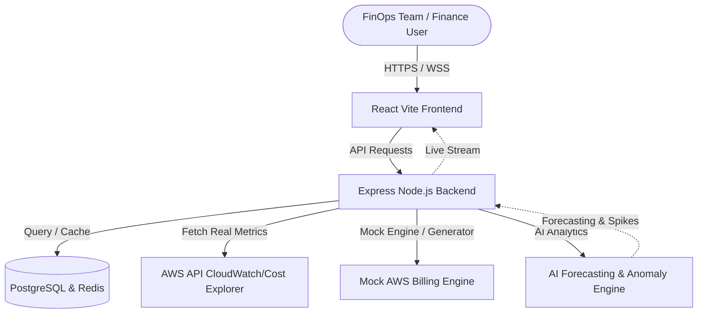

# CloudOptima AI - Financial Cloud Cost Optimization & FinOps Observability Platform

CloudOptima AI is a production-grade, enterprise-scale FinOps platform designed for large financial institutions to monitor, optimize, and forecast multi-cloud spending with real-time AWS, GCP, and Azure integration.

---

## Core System Architecture

The platform operates as a secure, containerized, microservices-ready monorepo with the following services structure:



---

## Features & Modules

### 1. Interactive Command Center Dashboard
- **Obsidian Dark Glassmorphism UI**: Beautiful gradients, micro-interactions (using Framer Motion), and high contrast views.
- **Service Spend Distribution**: Donut charts detailing Top 5 cloud service expenditures.
- **Daily Spend Trends**: Historical cost charts grouped by cloud providers.
- **Real-Time Telemetry Indicator**: Live node counts, S3 storage volumes, and compliance rates.

### 2. Multi-Cloud & Cost Analytics
- **Providers Switcher**: Compare AWS, GCP, and Azure expenditures.
- **Cost Allocation Audit**: Department-level (Engineering, Operations, Data Science, Finance) billing allocation tables.
- **Amortized vs. Unblended views**: Toggle amortized vs. unblended metrics on demand.

### 3. AWS Resource Telemetry & Rightsizing
- **Gauges & Sparklines**: Real-time CPU utilization sparklines of active EC2 instances.
- **Idle Waste Flagging**: Flags idle EC2 nodes (`cpu < 5%`) and RDS replicas.
- **Decommission Triggers**: Terminate or resize instances directly from the UI.

### 4. AI Forecasting & What-If Simulator
- **ML Time-Series Forecasting**: Linear Regression and seasonality adjusted curves with Upper/Lower confidence intervals.
- **What-If Sliders**: Drag parameters (Instance shutdown schedules, Spot instance migration, S3 Glacier tiering transition) to calculate simulated savings in real time.

### 5. Compliance & Security Governance
- **CIS Benchmarks Scanner**: Security rating auditing console.
- **IAM Vulnerability Alerts**: Audit logs flagging disabled MFA or stale access keys.
- **One-Click Auto-Remediation**: Correct IAM or S3 vulnerabilities automatically.

### 6. AI Copilot Chatbot Assistant
- **FinOps Copilot**: Float Chatbot supporting queries (e.g. "What is my next month forecast?" or "Show idle databases").
- **NLP Fallback**: Runs full natural language parser for offline use.

---

## Project Structure

```text
/Users/shashidhar/Cloud Computing/
├── frontend/                     # React + TypeScript + Vite + Tailwind CSS
│   ├── src/
│   │   ├── components/           # Sidebar, GlassCard, Chatbot UI
│   │   ├── pages/                # 10 core pages (Dashboard, Resources, AI Forecasting, etc.)
│   │   └── context/              # Global FinOpsContext State manager
├── backend/                      # Node.js + Express + TypeScript
│   ├── src/
│   │   ├── services/             # AWS SDK Provider, Mock Generator, Forecasting Engine
│   │   ├── socket/               # WebSockets telemetry stream server
│   │   └── app.ts                # Server entrypoint
├── database/                     # PostgreSQL schema & seeds scripts
└── devops/                       # Dockerfiles, docker-compose, Kubernetes & Terraform
```

---

## Local Run & Installation

### Option A: Spin Up via Docker Compose (Recommended)
This starts Postgres, Redis, the Express Backend, and the React Frontend on a private docker bridge network.

1. Ensure Docker Desktop is running.
2. Run from the project root:
   ```bash
   cd devops/docker
   docker-compose up --build
   ```
3. Open `http://localhost` (Nginx frontend) or check the backend API at `http://localhost:3001`.

### Option B: Local Manual Running

#### 1. Start Backend Server
Ensure Node.js v20+ is installed.
```bash
cd backend
npm install
npm run dev
```
The API server starts at `http://localhost:3001`.

#### 2. Start Frontend Server
In a separate terminal:
```bash
cd frontend
npm install
npm run dev
```
Open `http://localhost:5173`. Use credentials `admin@cloudoptima.com` with password `admin123` to log in.

---

## AWS Integration & Credentials Config
To connect the platform to your real AWS account:
1. Ensure your AWS IAM Role has ReadOnly access to CloudWatch and Cost Explorer APIs.
2. Set the following environment variables in `backend/.env` (or pass to Docker):
   ```ini
   AWS_ACCESS_KEY_ID=your_access_key
   AWS_SECRET_ACCESS_KEY=your_secret_key
   AWS_REGION=us-east-1
   ```
3. Re-sync your cloud accounts in the Admin panel. If variables are missing, the server operates in **Enterprise Mock Mode** to guarantee immediate demoability.
